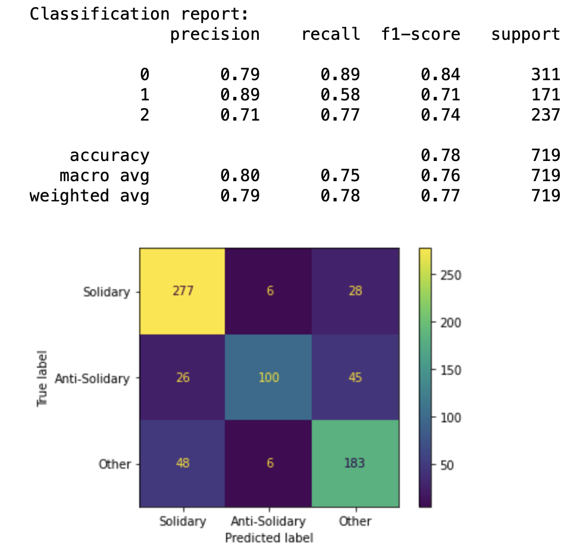

# Solidarity Twitter classification

## Dataset
|Orginal Training Set|Data Agumentation|Total|
|---|---|---|
|1.6k | 0.8k | 2.4k |

* Labels: Solidary, Anti-Solidary, Other

### Samples
* The dataset contains both English and German tweets.
    > @britishlivesuk Strange that a letter was written - most people nowadays just use their mobile phone. And he WILL have a smart phone- he's a 'refugee'!

    > #Moria evakuieren ist ein Gebot der Menschenrechte und der Humanität. Sozialdemokratie und christliche Werte bestimmen ja zum Glück die europäische und deutsche Politik. #LeaveNoOneBehind

## Training
Finetune RoBERTa
```bash
python3 train.py \
    --config config/experiment_roberta.yaml
```

## Results


* See also twitter-classification.ipynb